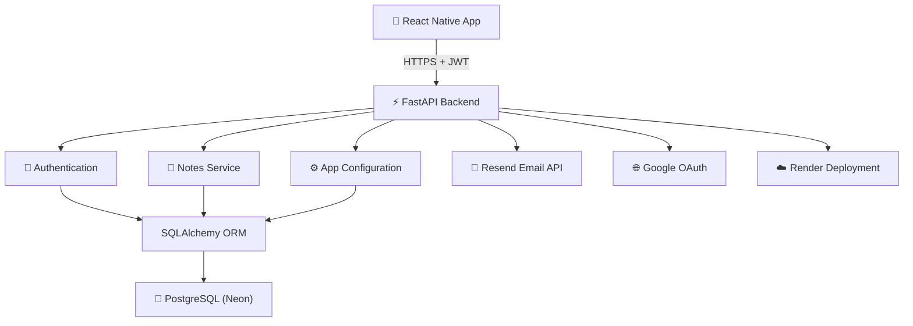

<h1 align="center">
Hi 👋, I'm Harsha Apoorv
</h1>

<h3 align="center">
Mobile Application Engineer • React Native • FastAPI
</h3>

Building scalable mobile applications used by thousands of users while crafting modern backend systems with clean architecture, performance-first engineering, and exceptional user experiences.

---

# 👨‍💻 About Me

I'm a **Mobile Application Engineer** with three years of experience building scalable cross-platform applications using **React Native**.

I enjoy transforming ideas into polished products by combining clean architecture, reusable components, thoughtful user experiences, and high-performance mobile engineering.

Beyond frontend development, I design secure backend services with **FastAPI** and **PostgreSQL**, continuously expanding my knowledge in backend system design, cloud-native architecture, and AI-powered mobile experiences.

---

# 🚀 Current Focus

- 📒 Expanding the **NotesApp** ecosystem
- 📱 Building scalable React Native applications
- ⚡ Designing modern FastAPI backend services
- 🤖 Exploring AI-powered mobile experiences
- ☁️ Learning distributed systems & cloud architecture

---

# 🛠️ Tech Stack

### 📱 Mobile Development

**Core Technologies**

`React Native` • `TypeScript` • `JavaScript`

**State Management**

`Redux Toolkit` • `RTK Query` • `Context API`

**Navigation & Architecture**

`React Navigation` • `Custom Hooks`

---

### ⚙️ Backend Development

**Frameworks & Database**

`FastAPI` • `PostgreSQL`

**ORM & Migrations**

`SQLAlchemy` • `Alembic`

**API Development**

`REST APIs` • `Pydantic`

---

### 🔐 Authentication & Security

`JWT Authentication` • `Google OAuth` • `Refresh Tokens`

`OTP Verification` • `Resend Email API`

---

### ☁️ Cloud & Dev Tools

`Git` • `GitHub`

`Render` • `Neon PostgreSQL`

`Android Studio` • `Xcode`

`VS Code` • `Figma`

---

# 💼 Professional Experience

## 📱 Mobile Application Engineer

### Tata Consultancy Services (TCS)

**Jun 2023 – Present**

- Built and enhanced production React Native features for the **Nest Pension** mobile application.
- Delivered multiple enterprise mobile releases with a focus on performance, scalability, and maintainability.
- Implemented modern state management using **Redux Toolkit** and **RTK Query**.
- Collaborated across teams to deliver high-quality features and improve the overall mobile experience.

**Tech**

`React Native` `Redux Toolkit` `RTK Query` `JavaScript`

---

## 📱 React Native Developer

### DuYu (Freelance)

**Dec 2024 – May 2025**

- Independently developed a cross-platform React Native application from concept to deployment.
- Implemented secure authentication, responsive UI, and scalable application architecture.
- Worked directly with stakeholders to translate business requirements into production features.

**Tech**

`React Native` `Redux Toolkit` `JavaScript`

---

# 🌟 Featured Projects

---

## 📒 NotesApp

A modern cross-platform note-taking application built with React Native, featuring secure authentication, offline support, cloud synchronization, and rich text editing.

### ✨ Highlights

- 🔐 Secure JWT Authentication
- 🌐 Google Sign-In
- ☁️ Cloud Synchronization
- 📱 Offline Support
- 📝 Rich Text Editor
- ⭐ Starred Notes
- 📤 Excel Export

### 🛠 Tech Stack

`React Native` `Redux Toolkit` `Google OAuth`

### 🔗 Repository

---

## 📱 Nest Pension App (TCS)

Official mobile application for one of the UK's largest workplace pension providers.

Contributed to the React Native application by delivering enterprise features, improving performance, and supporting multiple production releases for thousands of users.

### ✨ Highlights

- 📱 Cross-platform mobile development
- ⚡ Redux Toolkit & RTK Query
- 🚀 Multiple enterprise releases
- 🎯 Performance optimization
- 🏗️ Scalable mobile architecture

### 🛠 Tech Stack

`React Native` `Redux Toolkit` `Android/iOS`

---

## ⚙️ NotesApp Backend

Scalable FastAPI backend powering the complete NotesApp ecosystem with secure authentication, REST APIs, and cloud-native architecture.

### ✨ Highlights

- 🔐 JWT Authentication
- 🌐 Google OAuth
- 📧 OTP Email Verification
- ⚡ RESTful APIs
- 🗄️ PostgreSQL Database
- 📚 Interactive Swagger Documentation

### 🛠 Tech Stack

`Python` `FastAPI` `PostgreSQL`

### 🔗 Repository

---

## 🧮 React Native Calculator

A modern calculator application showcasing reusable components, custom hooks, theme management, and clean React Native architecture.

### ✨ Highlights

- 🌓 Light & Dark Themes
- 🧠 Custom Hooks
- 🎨 Responsive UI
- ➗ Accurate Calculations
- 🏗️ Clean Architecture

### 🛠 Tech Stack

`React Native` `Context API` `Custom Hooks`

### 🔗 Repository

---

## 🌐 Portfolio Website

Personal portfolio website showcasing my professional experience, featured projects, technical expertise, and software engineering journey.

### ✨ Highlights

- 💼 Professional Experience
- 🚀 Featured Projects
- 📱 Responsive Design
- ⚡ Fast Performance
- 🎨 Modern UI

### 🛠 Tech Stack

`React` `Tailwind CSS` `JavaScript`

### 🔗 Website

### 🔗 Repository

---

# 🏗️ NotesApp Ecosystem

The NotesApp ecosystem follows a layered architecture, separating the mobile application from backend services while maintaining secure authentication and scalable cloud infrastructure.

---

# 📈 GitHub Activity

> *GitHub statistics are automatically updated to reflect my latest contributions and public repositories.*

---

# 📚 Currently Learning

I'm continuously investing time in improving both mobile and backend engineering skills.

### Currently Exploring

- 🏗️ Backend System Design
- ☁️ Distributed Systems
- 🤖 AI for Mobile Applications
- ⚡ Cloud Architecture
- 🧠 Performance Optimization
- 🔒 Mobile Security Best Practices

---

# 🛣️ Roadmap

Here's what I'm currently building and planning next.

- [x] 📒 NotesApp (React Native)
- [x] ⚙️ NotesApp Backend
- [x] 🌐 Personal Portfolio
- [x] 🧮 React Native Calculator
- [ ] 🤖 AI-powered Notes Assistant
- [ ] 🖥️ Notes Desktop Application
- [ ] 🐳 Dockerized Deployment
- [ ] ☁️ CI/CD Pipeline
- [ ] 📊 Analytics Dashboard

---

# 🤝 Let's Connect

---

## Thanks for stopping by! 👋

I'm always excited to collaborate on **React Native**, **Backend Engineering**, and **AI-powered applications**.

If you enjoyed exploring my work, feel free to ⭐ my repositories or connect with me.

Happy Coding! 🚀

